# ROZRUCH
```docker-compose build```
```docker-compose up -d```

localhost:3000/map - aplikacja mapa do zarządzania kryzysowego
localhost:3000 - aplikacja zarządzanie magazynami

- Aplikacja do zarządznia i informowania na temat zasobów krytycznych
  - 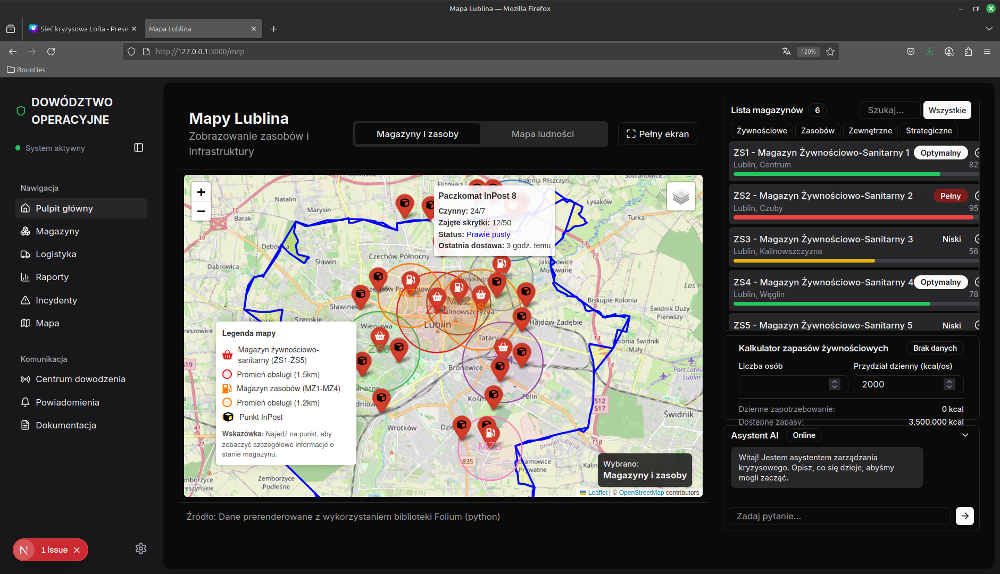
  - 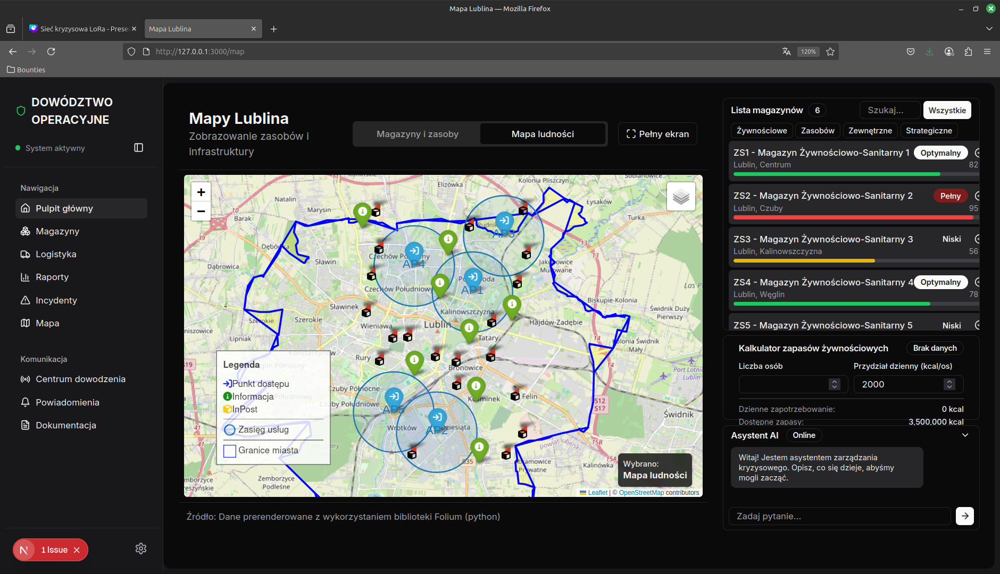
  
- System do zarządzania stanami magazynowymi
  - 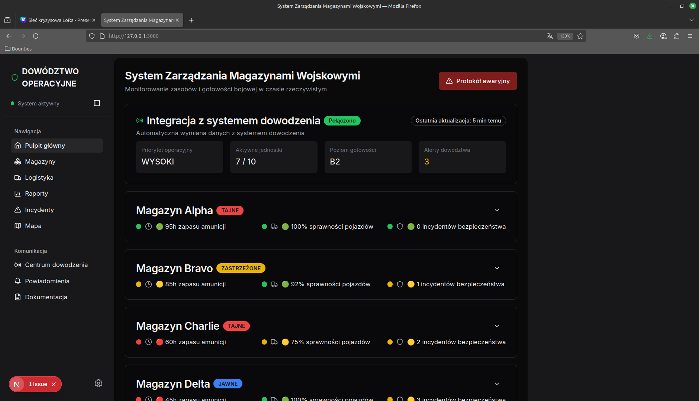
  - 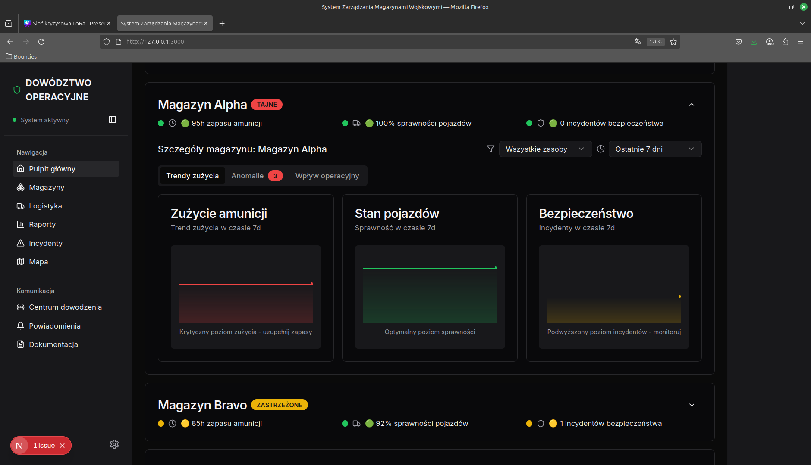
  - 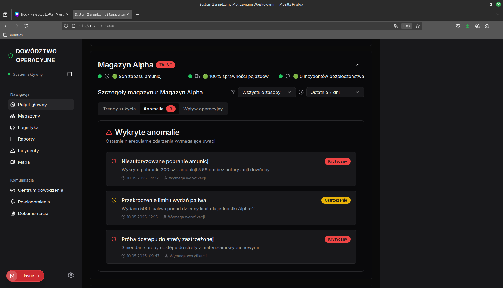
  - 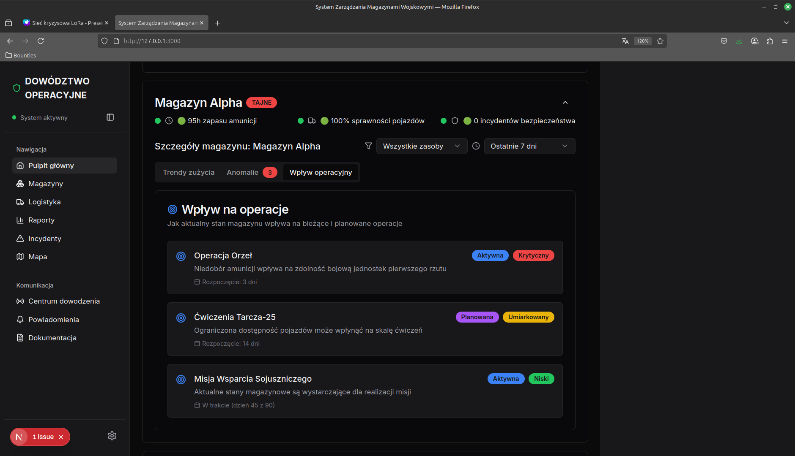
  
- Dokumentacja projektowa
  - 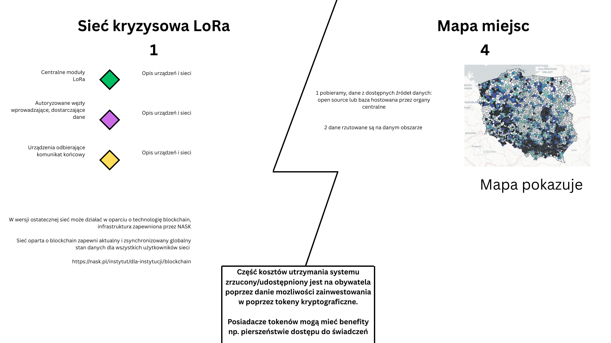
  - 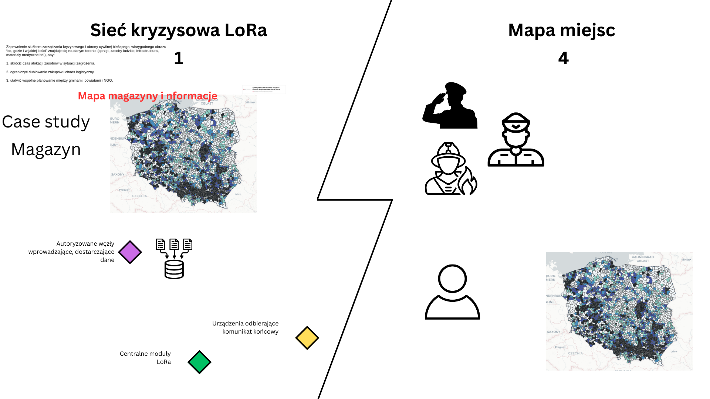
  - 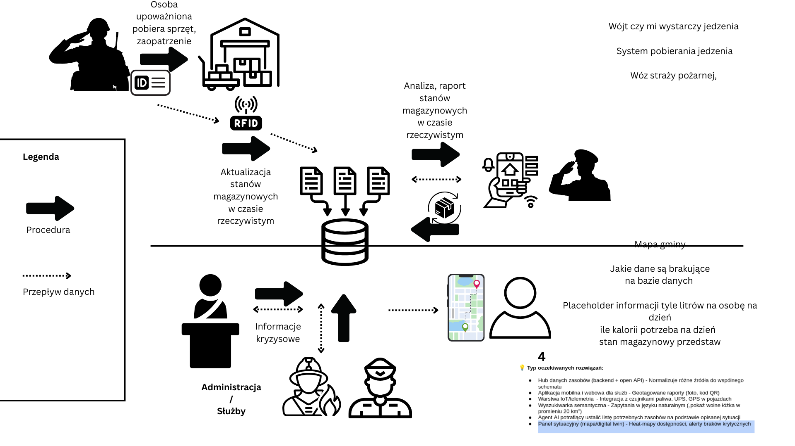
  - 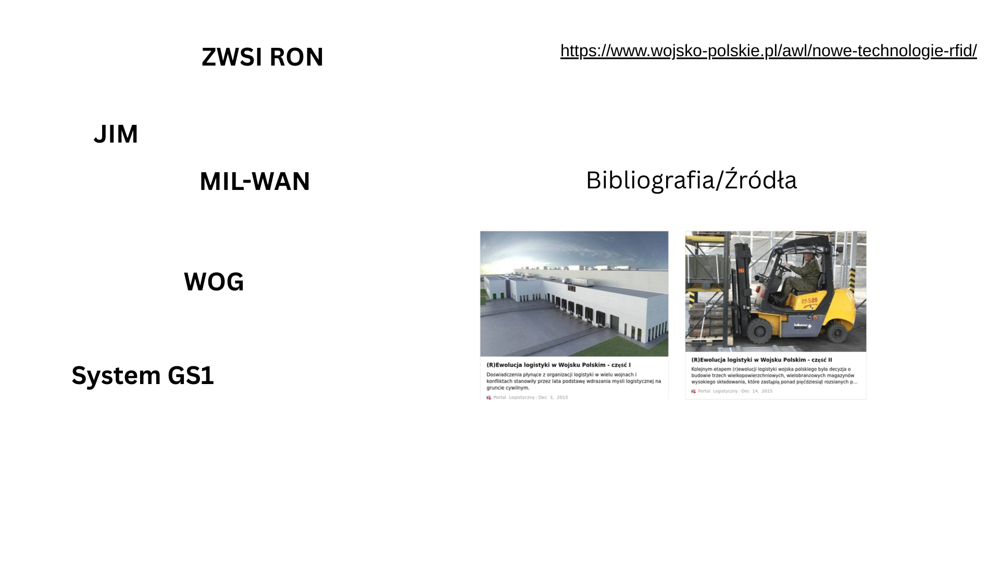
  - 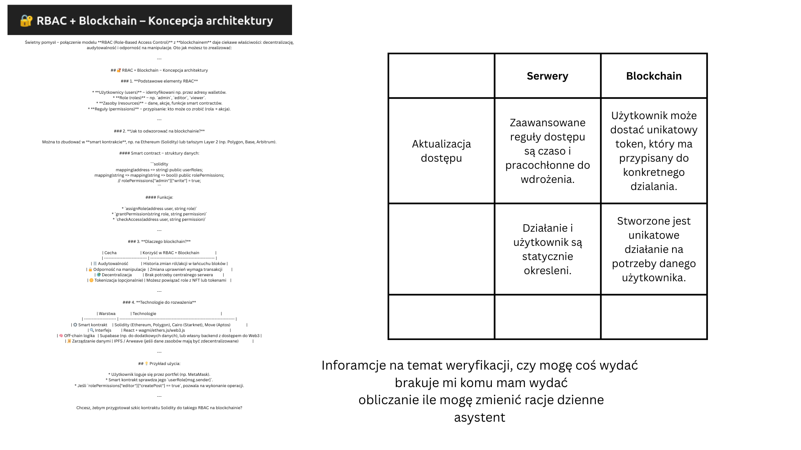
  - 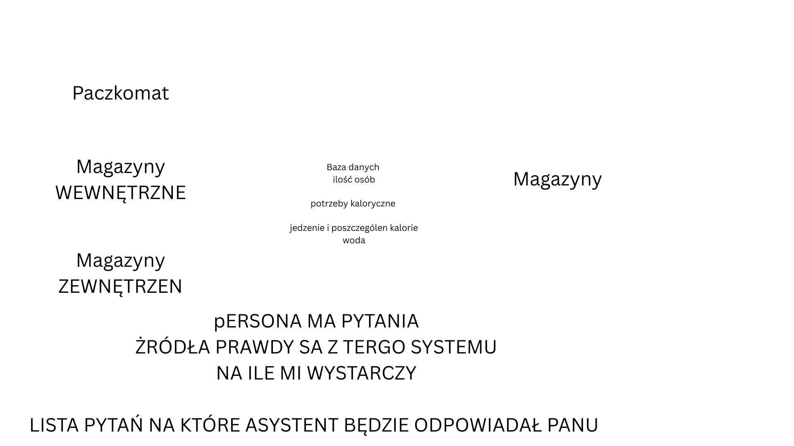